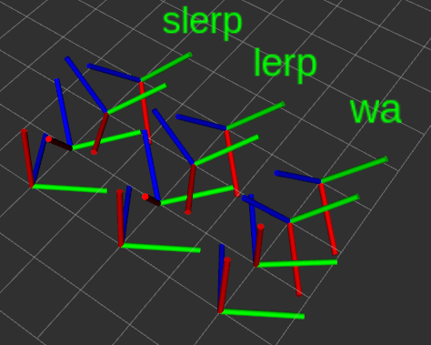

# Weighted Average of Quaternions

## Description

Implementation of weighted average of quaternions and compare it with SLERP / LERP.

## Result

Weighted average shows worse performance than SLERP and LERP

But why??

## Reference

* https://github.com/tolgabirdal/averaging_quaternions
* https://stackoverflow.com/questions/12374087/average-of-multiple-quaternions
* http://www.acsu.buffalo.edu/~johnc/ave_quat07.pdf
